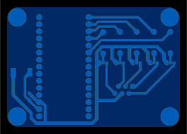

I have Novo motorized curtains that I can operate wirelessly using a remote (no Wi-Fi as this module is quite old). Although very helpful, curtains should not stand out in a smart home where everything is controlled by automation. In order to integrate my curtains into the Z-Wave network, I chose to create a simple DYI controller

## Approach

I utilized a Z-Uno project module (https://z-uno.z-wave.me) for the Z-Wave controller. According to Novo tech docs, they have a contract wired interface (RJ12), which makes everything really simple: the Z-Uno will supply Z-Wave interface and will control a curtain motor though dry contacts.



## Hardware design

The 5v power comes from DC barrel jack (5×2.1mm). Then to control the wires I only needed 4 transistors with 4 base resistors, and an RJ12 socket.



Parts list below:

|Part                                                  |
| ---------------------------------------------------- |
| 1x Z-Uno v1 or v2 (https://z-uno.z-wave.me)          |       
| 5x 1 kOm axial resistor                              |
| 5x NPN TO-92 transistor                              |
| 1x RJ12 through-hole socket                          |
| 1x 0.1u capacitor (optional)                         |
| 1x DC 5×2.1mm barrel socket with through-hole mount  |
| 1x 5v 5×2.1mm DC power supply                        |

The PCB is one-sided and very basic because I made with my tiny home CNC. I only used through-hole contacts since they are simpler for me to solder (YMMW).






